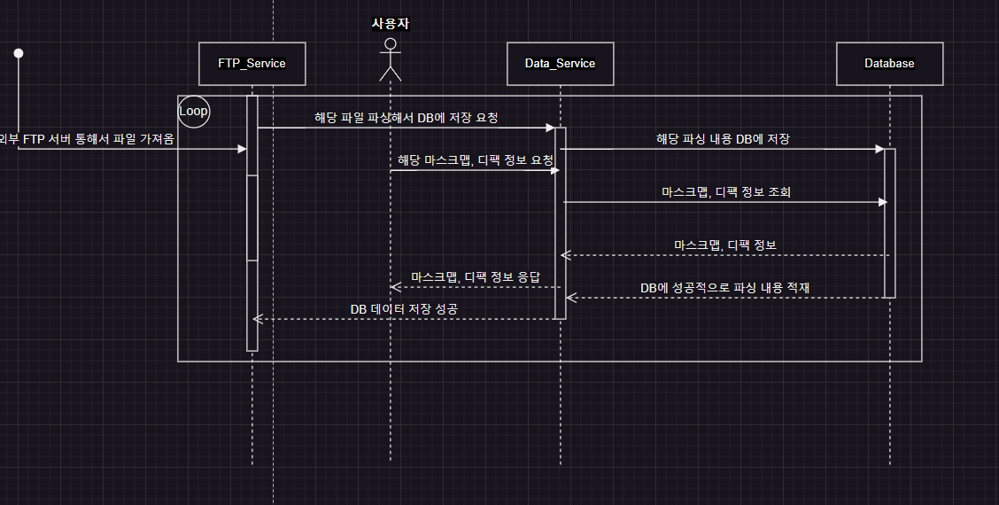
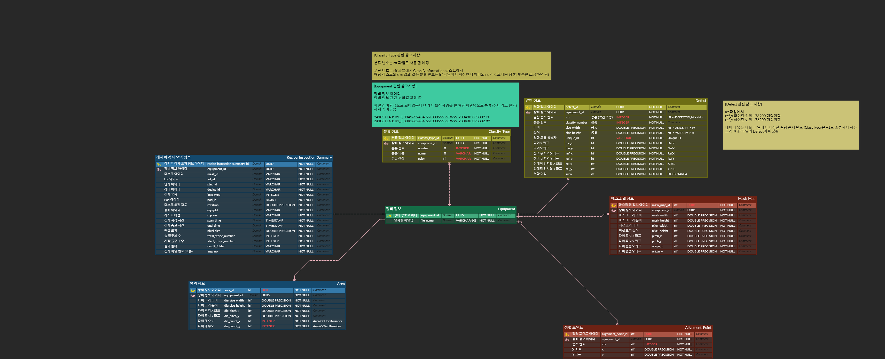
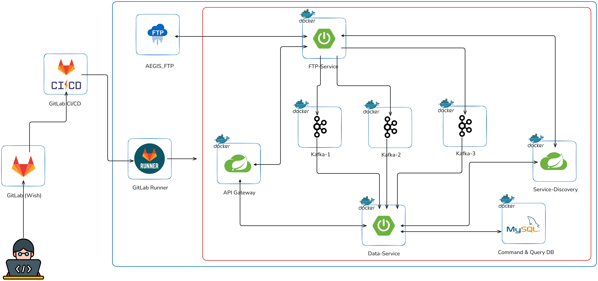

# Mask Map & Defect List (AEGIS, Term-Project)

## ✨ 프로젝트 개요

### 1. 프로젝트명

Mask Map & Defect List Detection

### 2. 프로젝트 기간

2024.10.28 ~ 2024.11.08 (2주)

- 시스템 아키텍처 설계 및 데이터 분석, ERD 구성: 5일
- 백엔드 개발: 5일

### 3. 프로젝트 주제

Mask Map & Defect List 데이터를 관리하고 분석하여 결함을 효과적으로 검출 및 시각화하는 시스템

### 4. 프로젝트 특이점

- API Gateway를 통해 외부 요청을 중앙에서 관리하고, 각 서비스로의 트래픽을 효율적으로 분배하여 보안과 확장성을 높였습니다.
- FTP-Service가 외부 FTP 서버와 연결하여 파일을 주기적으로 확인하고, 이미 처리한 파일을 제외한 새로운 파일만을 다운로드하여 처리합니다.
- 데이터 전처리 및 메시지 브로커 연동: FTP 서버에서 다운로드 및 파싱한 데이터를 전처리하여 Kafka를 통해 Data-Service에 이벤트 형태로 전달, 이를 통해 비동기 데이터 흐름을 구현했습니다.
- Data-Service는 Kafka로부터 전송받은 이벤트를 받아 데이터베이스에 저장하고, 필요한 경우 추가 가공 및 조회 기능을 제공합니다.
- 헥사고날 아키텍처 (Hexagonal Architecture)를 적용하여 각 서비스의 핵심 로직과 외부 인터페이스를 분리함으로써 유지보수성과 확장성을 강화했습니다.
- CQRS 패턴을 도입하여 커맨드(Command)와 쿼리(Query) 책임을 분리하여 성능을 최적화하였으며, 추후 쿼리 부분에 대해 MongoDB와 같은 NoSQL을 사용할 수 있도록 설계했습니다.

## 🚀 기술 스택

### Back-End

- JAVA `21.0.4 LTS`
- Spring Boot `3.3.5`
- Lombok
- Gradle
- Spring Cloud (API Gateway)
- Spring Netflix Eureka
- Spring Data JPA
- Spring Integration FTP
- Kafka
- Jasypt

### DB

- PostgreSQL

### Infra

- Ubuntu
- Docker
- Docker Compose
- GitLab CI/CD
- GitLab Runner
- Slack

## 📂 프로젝트 구조

### 모듈별 역할 및 의존성 요약

- Service-Discovery
  - 역할: 서비스 등록과 발견을 위한 Eureka 서버
  - 의존성:
    - spring-cloud-starter-netflix-eureka-server
  
- Global-Module
  - 역할: 공통 모듈로서 다른 서비스에서 공유하는 기능 제공
  - 의존성:
    - spring-boot-starter-data-jpa: JPA 지원
    - jasypt-spring-boot-starter: 암호화 라이브러리
    - spring-kafka: Kafka 통합
    - spring-boot-starter-data-mongodb: MongoDB 지원

- FTP-Service
  - 역할: 외부 FTP 서버에서 파일을 가져와 처리하는 역할
  - 의존성:
    - Global-Module 모듈 의존
    - spring-cloud-starter-netflix-eureka-client: Eureka 클라이언트
    - spring-cloud-starter-openfeign: Feign 클라이언트
    - spring-boot-starter-web: 웹 서버 및 REST API
    - spring-integration-ftp: FTP 서버와 통합

- Data-Service
  - 역할: 데이터 처리 및 DB 저장 및 데이터 정보 조회
  - 의존성:
    - Global-Module 모듈 의존
    - spring-cloud-starter-netflix-eureka-client: Eureka 클라이언트
    - spring-cloud-starter-openfeign: Feign 클라이언트
    - spring-boot-starter-data-jpa: JPA 지원
    - spring-boot-starter-web: 웹 서버 및 REST API
    - mapstruct: 객체 매핑
    - spring-kafka: Kafka 통합
    - postgresql: PostgreSQL 드라이버

- API-Gateway
  - 역할: 클라이언트와 백엔드 서비스 간의 API 게이트웨이
  - 의존성:
    - spring-cloud-starter-gateway: API Gateway
    - spring-cloud-starter-netflix-eureka-client: Eureka 클라이언트
    - spring-boot-starter-actuator: 애플리케이션 상태 모니터링
    - jjwt: JWT 인증

## Sequence Diagram

## ERD

## System Architecture

